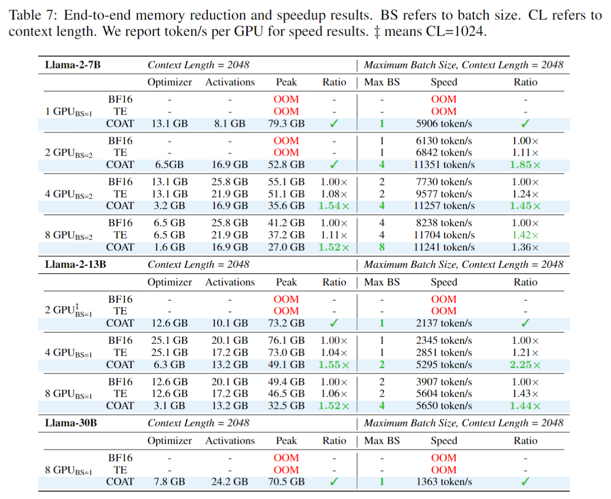
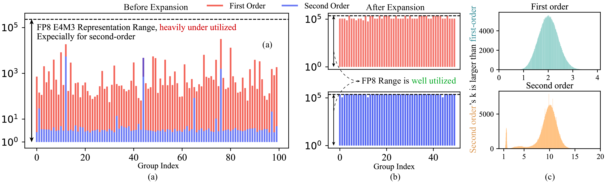
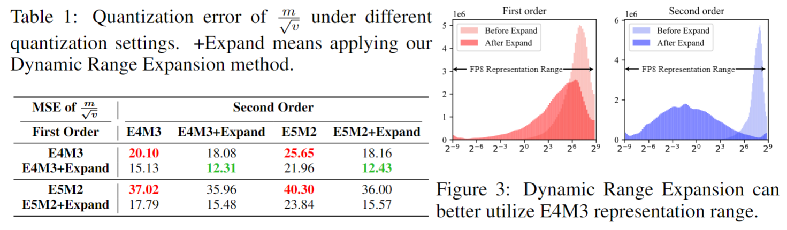
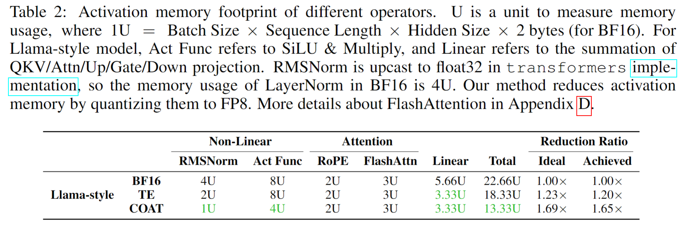
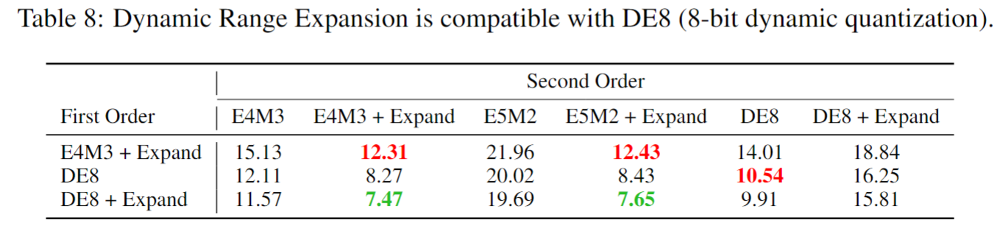
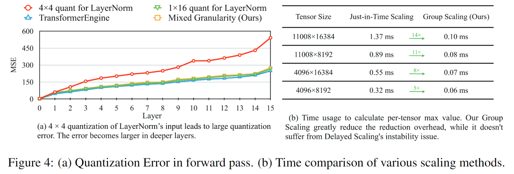

<p align="center" style="border-radius: 10px">
  
</p>

# 🚀COAT: Compressing Optimizer states and Activation for Memory-Efficient FP8 Training

### [[paper]](https://arxiv.org/abs/2410.19313)

<p align="center" style="border-radius: 10px">
  
</p>

## 💡 Introduction
We introduce COAT (Compressing Optimizer states and Activation for Memory-Efficient FP8 Training), a novel method designed to optimize the memory efficiency of training large models by compressing optimizer states and activations using FP8 quantization.

This technique allows:

- Reduced end-to-end memory footprint by 1.54× 
- Speedup training by 1.43× while maintaining model accuracy
- Double the batch size and utilize GPU better
- Scalable performance for large-scale AI models

By leveraging FP8 precision, COAT significantly decreases memory usage by 1.54×, which is critical for training large models on limited hardware resources.

## 🔥 News

- [2024/10] [[paper]](https://arxiv.org/abs/2410.19313) is on arxiv!

## 📚 Abstract
FP8 training has emerged as a promising method for improving training efficiency. Existing frameworks accelerate training by applying FP8 computation to linear layers while leaving optimizer states and activations in higher precision, which fails to fully optimize memory usage. This paper introduces COAT (**C**ompressing **O**ptimizer States and **A**ctivations for FP8 **T**raining), a novel FP8 training framework designed to significantly reduce memory footprint when training large models. 

COAT addresses current limitations through two key innovations: (1) **Dynamic Range Expansion**, which aligns optimizer state distributions more closely with the FP8 representation range, thereby reducing quantization error, and (2) **Mixed-Granularity Activation Quantization**, which optimizes activation memory using a combination of per-tensor and per-group quantization strategies. 

Experiments demonstrate that COAT effectively reduces end-to-end training memory footprint by **1.54×** compared to BF16 while achieving nearly lossless performance across various tasks, such as Large Language Model pretraining and fine-tuning and Vision Language Model training. COAT also achieves a **1.43×** end-to-end training speedup compared to BF16, performing on par with or surpassing TransformerEngine's speedup. COAT enables efficient full-parameter training of large models on fewer GPUs, and facilitates doubling the batch size in distributed training settings, providing a practical solution for scaling large-scale model training.


## 📊 Performance
In all multi-GPU training setting, COAT can double the micro-batch size and therefore lead to even higher speedup. For example, our method can achieve $2.25\times$ speedup when training Llama-2-13B on 4-GPUs since we can effectively increase the batch size to 2.

Overall, COAT significantly reduces end-to-end memory usage by up to $1.55\times$ and speeds up the end-to-end training by nearly $1.44\times$. This facilitates full-parameter training on fewer GPUs, which is particularly beneficial for larger language models.

<p align="center" style="border-radius: 10px">
  
</p>

## 🔍 Key Observations
- FP8 E4M3's representation range is **under-utilized** for optimizer states quantization. The second-order momentum's dynamic range is also smaller than first order momentum's.

<p align="center" style="border-radius: 10px">
  
</p>

- **Dynamic Range Expansion** can fully utilize the FP8's representation range, therefore greatly reduce the quantization error. This finding is also compatible with other [data formats](https://arxiv.org/abs/2110.02861) than FP8.

<p align="center" style="border-radius: 10px">
  
</p>

- Quantizing non-linear layers is important to reduce memory consumption. It usually consumes much more memory than linear layers.

<p align="center" style="border-radius: 10px">
  
</p>

<p align="center" style="border-radius: 10px">
  
</p>

- Mixed granularity FP8 Precision Flow optimizes memory and accuracy for activation quantization. **FP8 precision flow** means the input and the output of every linear and non-linear operator is in FP8 precision and reduces the memory footprint by 2×. **Mixing the granularity** of linear and non-linear layers can improve the quantization accuracy. **Group Scaling** is used to further reduce the overhead for just-in-time scaling.

<p align="center" style="border-radius: 10px">
  
</p>

## 💪To-Do List
We will try our best to release

- \[ \] COAT on [TorchTitan](https://github.com/pytorch/torchtitan)
- \[ \] COAT on [FSDP2](https://github.com/pytorch/torchtitan/blob/main/docs/fsdp.md)
- \[ \] COAT on [VILA](https://github.com/NVlabs/VILA)

## FAQ
If you have some problem when installing `qoptim_cuda`, you can try to install cudatoolkit following [this link](https://stackoverflow.com/questions/39379792/install-cuda-without-root)

## Citation
```
@misc{xi2024coatcompressingoptimizerstates,
      title={COAT: Compressing Optimizer states and Activation for Memory-Efficient FP8 Training}, 
      author={Haocheng Xi and Han Cai and Ligeng Zhu and Yao Lu and Kurt Keutzer and Jianfei Chen and Song Han},
      year={2024},
      eprint={2410.19313},
      archivePrefix={arXiv},
      primaryClass={cs.LG},
      url={https://arxiv.org/abs/2410.19313}, 
}
```